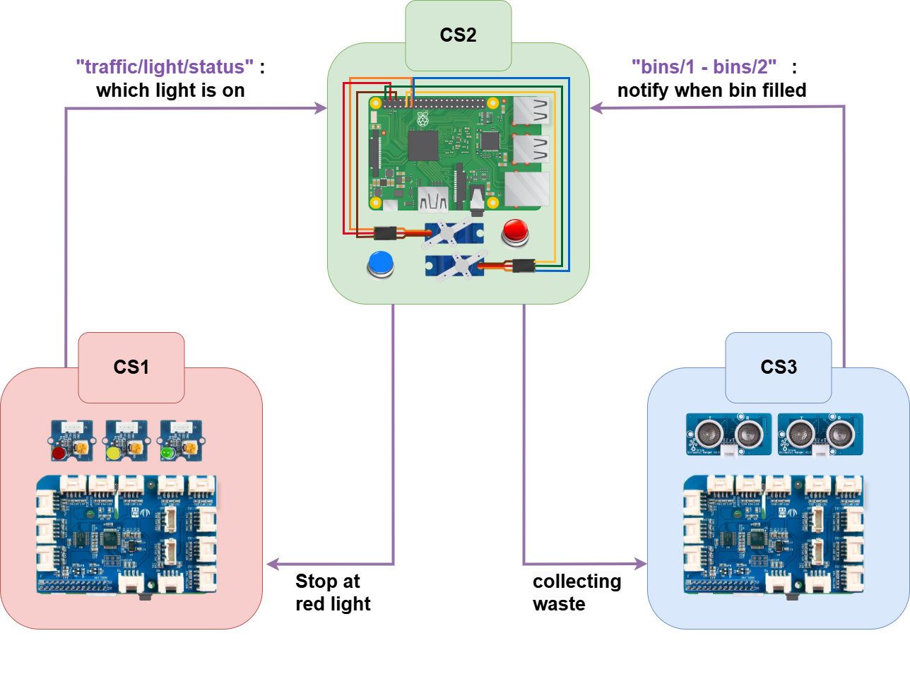

# Smart Waste Collection System and its Digital Twin

This repository implements a Smart Waste Collection System based on a system-of-systems (SoS) architecture for smart city infrastructure management. Inside the /src folder, the project is divided into two main parts:

- **Physical Twin:** Code running on physical devices (Raspberry Pi, sensors, actuators, etc.) that controls traffic lights, fleet trucks, and waste bin monitoring.
- **Digital Twin:** Code developed in Godot that represents the Digital Twin (DT) and visualizes the physical system for digital monitoring and control.

---

## Physical SoS Architecture

Below is a figure illustrating the overall SoS. It shows how different components (CS1, CS2, CS3) communicate via MQTT to accomplish the objectives of the SoS and how they are physically connected:

1. **CS1 (Traffic Lights):**  
   - Publishes traffic light status via the topic `traffic/lights/status` to the MQTT broker located in the CS2.  

2. **CS2 (Collection Trucks):**  
   - Contains the MQTT broker.
   - Subscribes to the traffic light status from CS1 and bins data from CS3.
   - Perform actions such as stoping at the red lights and collecting the waste from filled bins

3. **CS3 (Waste Bins):**  
   - Publishes sensor readings to the CS2, which then triggers waste collection of the closest truck.

## SoS DT Architecture

## Folder Structure

- **Physical Twin:**  
  Contains Python code that runs on Raspberry Pi devices. It comprises three main modules:
  - **Traffic Light Control:** Manages LED traffic lights and publishes their status via MQTT.
  - **Fleet Management:** Simulates and controls truck movement using servo motors, MQTT messaging, and GPIO inputs.
  - **Bin Monitoring and Disturbance Simulation:** Monitors waste bins using ultrasonic and DHT sensors.
  
- **Digital Twin (Godot):**  
  Contains the Godot project that represent the digital shadows and twin to:
  - Provide real-time visualization of the system’s behavior.
  - Allow for remote monitoring.

---

## 1. Physical Twin Folder

#### 1. Traffic Light Control Module (`src/physicalTwin/lighting/classes.py`)
- **`PTLightingEdge`:**  
  - Entry point for the traffic light system.
  - Initializes the sensor module and starts the traffic cycle.
  
- **`PTLightingSensor`:**  
  - Controls the red, yellow, and green LEDs.
  - Publishes the current traffic light status via MQTT.
  - Manages the traffic light cycle (red → green → yellow).

#### 2. Fleet Management Module (`src/physicalTwin/fleet/classes.py`)
- **`PTFleetEdge`:**  
  - Main controller for fleet management.
  - Initializes the fleet sensor and starts truck operations.
  
- **`PTFleetSensor`:**  
  - Sets up an MQTT client to listen to topics (traffic lights, bin sensors).
  - Monitors GPIO buttons to simulate truck braking.
  - Processes incoming MQTT messages to update truck statuses.
  
- **`PTTruck` (Base Class):**  
  - Manages truck movement via a servo motor.
  - Implements acceleration and stop logic.
  
- **`PTTruck1` and `PTTruck2` (Derived Classes):**  
  - Specialized truck classes with unique GPIO pin configurations.
  - Run independent control loops using multi-threading.

#### 3. Bin Monitoring and Disturbance Simulation Module (`src/physicalTwin/bins/classes.py`)
- **`PTBinsEdge`:**  
  - Entry point for the bin monitoring system.
  - Initializes the bins sensor and starts sensor monitoring.
  
- **`PTBinsSensor`:**  
  - Manages the LCD display for showing bin status.
  - Sets up an MQTT client to subscribe to bin disturbance messages.
  - Updates the LCD text and background color based on sensor data.
  
- **`PTUltrasonicDHT`:**  
  - Extends the bins sensor to include ultrasonic and DHT sensor readings.
  - Calculates bin fullness and publishes sensor data.
  - Contains a keyboard listener (in a separate thread) to simulate disturbances.
  
- **`LCD`:**  
  - Controls the LCD display via I2C.
  - Provides functions for setting text (with/without refresh), changing background color, and creating custom characters.

## 2. Digital Twin Folder

This folder needs to be imported in GoDot
